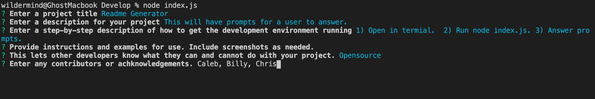
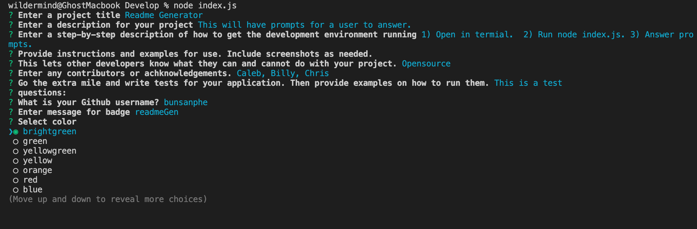
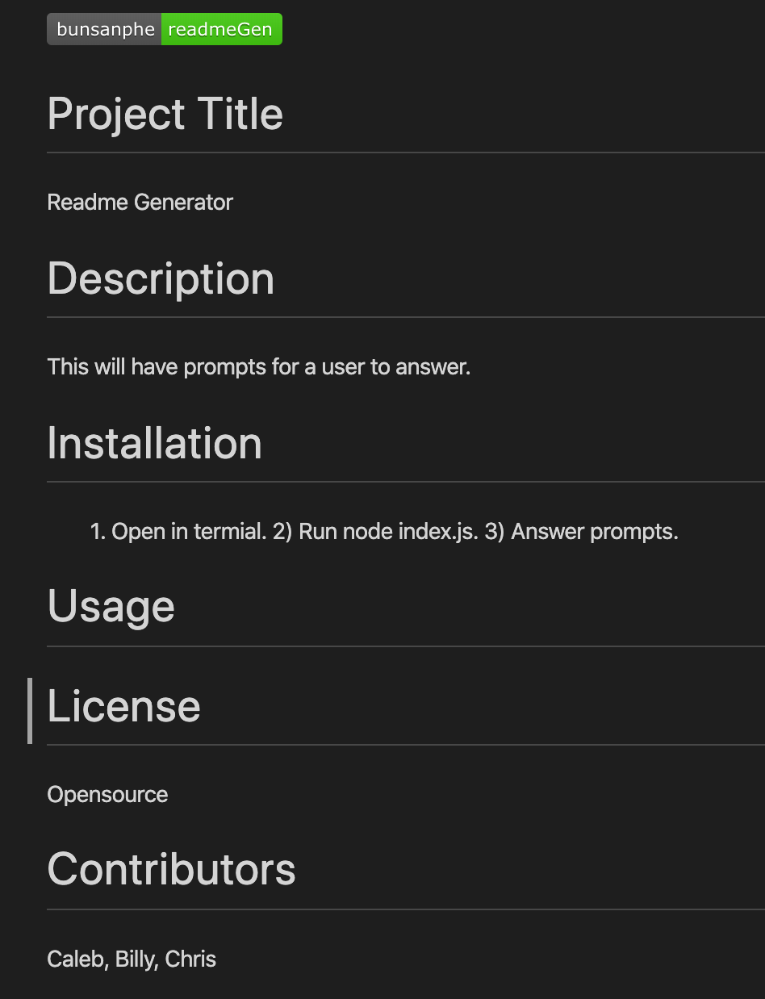

# README Generator

Create a command-line application that dynamically generates a README.md from a user's input. The application will be invoked with the following command:

```sh
node index.js
```

The user will be prompted for their GitHub username and other information pertaining to the project the README is for.

The README will be populated with the following:

* At least one badge
* Project title
* Description
* Table of Contents
* Installation
* Usage
* License
* Contributing
* Tests
  * User GitHub profile picture
  * User GitHub email

```
AS A developer

I WANT a README generator

SO THAT I can easily put together a good README for a new project
```
```
GIVEN the developer has a GitHub profile and a repository

WHEN prompted for the developer's GitHub username and repo specific information

THEN a README for the repo is generated
```
- - -

# Test
Test Image 1:


Test Image 2:


Results Image:
